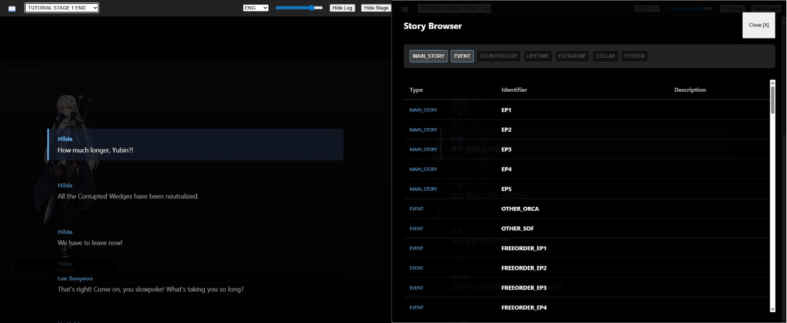

# Counter:Side Story Reader
This is a reader for the game Counter:Side. It runs in the web-browser, but because there's so many huge files, you need a webserver.  

**공지:** 일부 UI 요소는 아직 현지화되지 않았을 수 있으나, 전체 스토리 텍스트는 이용 가능합니다.  
**聲明:** 部分使用者介面元素可能尚未本地化，但完整的故事文本已發布。  
**免責事項:** 一部のUI要素はまだローカライズされていない可能性がありますが、ストーリーの全文はお読みいただけます。  

[Roadmap](./notes/ROADMAP.md) | [ロードマップ](./notes/ROADMAP.JP.md) | [로드맵](./notes/ROADMAP.KR.md) | [項目路線圖](./notes/ROADMAP.TW.md)

First, download the folder by clicking **"Code"** -> **"Download ZIP"**.  
먼저 **"Code"** -> **"Download ZIP"** 을 클릭하여 폴더를 다운로드하세요.  
首先，點擊 **"Code"** -> **"Download ZIP"** 下載資料夾。  
まず、**"Code"** -> **"Download ZIP"** をクリックしてフォルダをダウンロードしてください。 

On Windows, you can just:
1. Double-click the `LaunchReader.bat` file.
2. If a Windows Defender/Firewall popup appears, click "Allow Access" (this is just allowing the local server to talk to your own browser).
3. The browser should open automatically to `http://localhost:9128`.
Note: Keep the command prompt window open while you are using the reader. Closing it will stop the server.

On macOS & Linux, you can similarly click LaunchReaderMacOS.command or LaunchReaderLinux.sh,
BUTTTTTTTTTTTTTTTTTTTTTTTTTTTTTTTTTTTTTTTTT  
You need to give the files permission to run first:
1. Open Terminal
2. Type `chmod +x ` (make sure there is a space at the end).
3. Drag the `LaunchReader.command` (Mac) or `LaunchReader.sh` (Linux) file into the terminal window. It should look like:
    `chmod +x /path/to/LaunchReader.command`
4. Press *Enter*.

---

# 카운터사이드 스토리 리더 (Counter:Side Story Reader)
본 프로그램은 카운터사이드용 스토리 리더입니다. 웹 브라우저에서 실행되지만, 대용량 파일이 많기 때문에 별도의 웹 서버가 필요합니다.

**Windows 사용자:**
1. `LaunchReader.bat` 파일을 더블 클릭하세요.
2. Windows Defender/방화벽 팝업이 나타나면 "액세스 허용"을 클릭하세요 (로컬 서버가 브라우저와 통신하기 위해 필요합니다).
3. 브라우저가 `http://localhost:9128` 주소로 자동 실행됩니다.
**참고:** 리더를 사용하는 동안에는 명령 프롬프트(검은 창)를 닫지 마세요. 창을 닫으면 서버가 중단됩니다.

**macOS 및 Linux 사용자:**
`LaunchReaderMacOS.command` 또는 `LaunchReaderLinux.sh`를 실행하면 되지만, **먼저 실행 권한을 부여해야 합니다:**
1. 터미널(Terminal)을 엽니다.
2. `chmod +x `를 입력합니다 (마지막에 공백 한 칸을 반드시 넣으세요).
3. `LaunchReader.command` (Mac) 또는 `LaunchReader.sh` (Linux) 파일을 터미널 창으로 드래그합니다. 다음과 같이 표시됩니다:
   `chmod +x /파일/경로/LaunchReader.command`
4. *Enter* 키를 누릅니다.

---

# 異界事務所 劇情閱讀器 (Counter:Side Story Reader)
這是一個為《異界事務所》開發的劇情閱讀器。雖然在瀏覽器中執行，但由於檔案較大，需要透過網頁伺服器運作。

**Windows 用戶：**
1. 雙擊執行 `LaunchReader.bat`。
2. 如果彈出 Windows Defender/防火牆提示，請點擊「允許存取」（這只是為了讓本機伺服器與您的瀏覽器進行連線）。
3. 瀏覽器將會自動開啟至 `http://localhost:9128`。
**注意：** 使用閱讀器時請保持命令提示字元視窗開啟。關閉視窗將會停止伺服器運作。

**macOS 與 Linux 用戶：**
您可以點擊 `LaunchReaderMacOS.command` 或 `LaunchReaderLinux.sh`，**但在此之前您必須先賦予檔案執行權限：**
1. 開啟終端機 (Terminal)。
2. 輸入 `chmod +x `（請確保最後有一個空白字元）。
3. 將 `LaunchReader.command` (Mac) 或 `LaunchReader.sh` (Linux) 檔案拖入終端機視窗。路徑會顯示如下：
   `chmod +x /檔案/路徑/LaunchReader.command`
4. 按下 *Enter* 鍵。

---

# カウンターサイド ストーリーリーダー (Counter:Side Story Reader)
このプログラムは「カウンターサイド」のストーリー閲覧用リーダーです。ウェブブラウザ上で動作しますが、大容量ファイルを扱うためウェブサーバーが必要になります。

**Windowsの場合:**
1. `LaunchReader.bat` ファイルをダブルクリックしてください。
2. Windows Defenderやファイアウォールの警告が表示された場合は、「アクセスを許可する」をクリックしてください（ローカルサーバーとブラウザを通信させるために必要です）。
3. ブラウザが自動的に開き、`http://localhost:9128` にアクセスします。
**注意:** リーダーを使用している間は、コマンドプロンプトの画面を閉じないでください。閉じるとサーバーが停止します。

**macOSおよびLinuxの場合:**
`LaunchReaderMacOS.command` または `LaunchReaderLinux.sh` を使用しますが、**実行前にファイルに権限を与える必要があります:**
1. ターミナル (Terminal) を開きます。
2. `chmod +x ` と入力します（最後に必ずスペースを入れてください）。
3. `LaunchReader.command` (Mac) または `LaunchReader.sh` (Linux) ファイルをターミナルウィンドウにドラッグ＆ドロップします。以下のように表示されます：
   `chmod +x /ファイルの/パス/LaunchReader.command`
4. *Enter* キーを押します。

## Credits & Licenses

- **Counterside Story Reader**: Created by myrhhcaiah.
- **Game Content**: All assets and data are property of Studiobside.
- **Web Server**: This distribution includes [miniserve](https://github.com/svenstaro/miniserve), licensed under the MIT License. See `licenses/MINISERVE-LICENSE.txt` for details.
